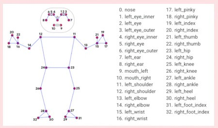

# Contexto
Ya no es solo es una prueba XD

es necesario determinar ángulos y distancias del cuerpo para el llenado de una matriz RULA. 
La matriz RULA es una herramienta de evaluación ergonómica que se utiliza para evaluar el 
riesgo de lesiones en los miembros superiores. La matriz se basa en tres factores:

Postura del cuerpo: Se evalúa la postura del cuerpo en función de la posición de la cabeza, 
el cuello, los hombros, los codos, las muñecas y las manos.
Fuerza: Se evalúa la fuerza que se utiliza en la tarea.
Repetitividad: Se evalúa la frecuencia con la que se repite la tarea.

Para determinar los ángulos y distancias del cuerpo, se utilizan las siguientes mediciones:

Ángulo del cuello: Se mide el ángulo entre la cabeza y el cuello.
Ángulo de los hombros: Se mide el ángulo entre los hombros y el torso.
Ángulo de los codos: Se mide el ángulo entre los codos y el torso.
Ángulo de las muñecas: Se mide el ángulo entre las muñecas y el torso.
Distancia de la mano al trabajo: Se mide la distancia entre la mano y el trabajo.

Estas mediciones se utilizan para asignar un puntaje a cada factor de la matriz RULA. El 
puntaje total de la matriz indica el riesgo de lesiones en los miembros superiores.

En general, cuanto mayor sea el puntaje de la matriz, mayor será el riesgo de lesiones. Los
puntajes de la matriz RULA se interpretan de la siguiente manera:

Puntaje 1-2: Bajo riesgo
Puntaje 3-4: Moderado riesgo
Puntaje 5-6: Alto riesgo

## Interfaz by Itala

## Brazo (angulos) by Oliver
Usaré La carpeta learn pose estimation para aprender lo visot en el siquiente video 
https://youtu.be/brwgBf6VB0I?si=fz_-SE-K2SxTCzjV
No subo los archivos de video debido al peso que tienen pero lo pueden encontrar en el siguiguiente link:
https://drive.google.com/drive/folders/13Rt3yZ8q1Q5W4QiTuGVKp8SKV9ffAOO0?usp=drive_link
### Contexto sobre lo que se requiere

Altura de los brazos:

Se evalúa la altura de los codos con respecto al cuerpo y al nivel de la estación de trabajo. Se busca determinar si los brazos están demasiado altos, demasiado bajos o en una posición neutral.
La posición de los codos y las manos en relación con la altura de la estación de trabajo es importante para prevenir tensiones innecesarias en los músculos y articulaciones.
Ángulo de los brazos:

Se analiza el ángulo formado por los brazos en relación con el cuerpo. Esto se refiere a la extensión o flexión de los codos.
Se buscan ángulos que puedan causar estrés o tensión en los músculos y articulaciones, especialmente si se mantienen durante períodos prolongados.
Distancia entre el cuerpo y los brazos:

La evaluación también tiene en cuenta la distancia entre el tronco y los brazos. Se busca determinar si los brazos están extendidos hacia adelante, si están pegados al cuerpo o si hay una posición intermedia.
Una posición extrema hacia adelante puede aumentar la carga en la parte superior del cuerpo, mientras que una posición muy pegada al cuerpo puede afectar la libertad de movimiento.

## Cuello (angulos) by Johan

